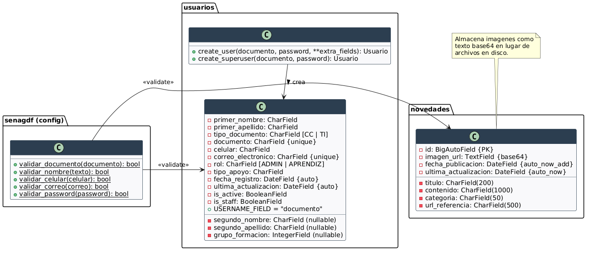
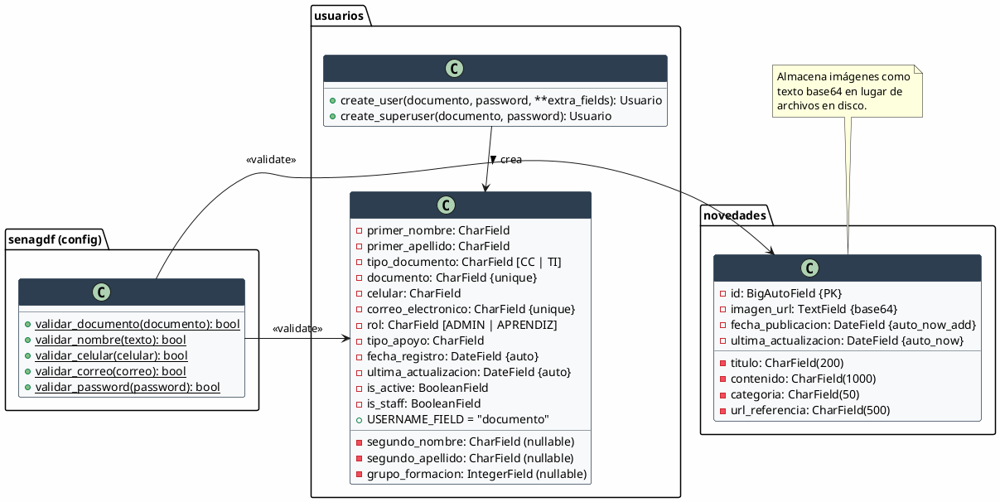
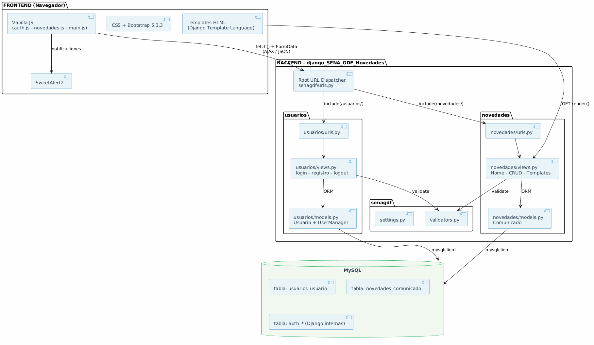
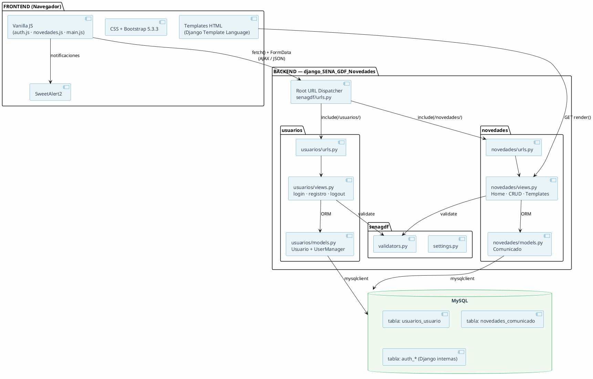
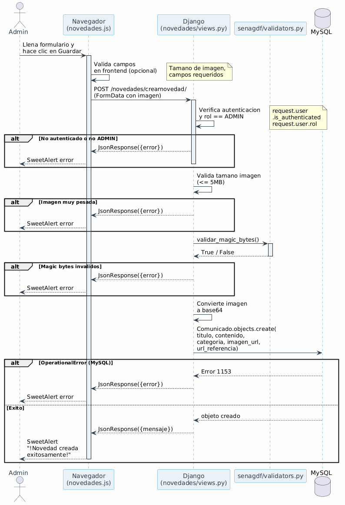
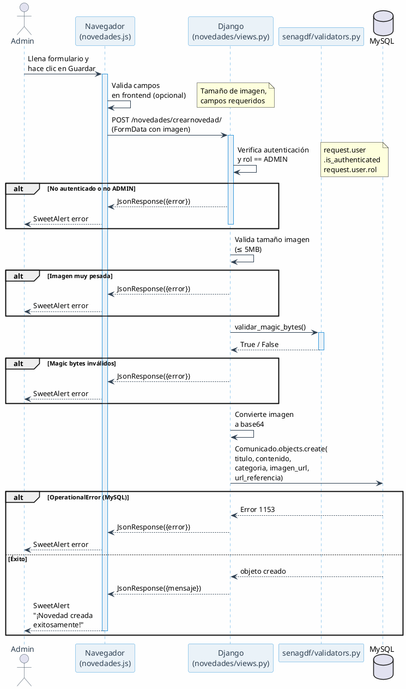

# SENA GDF — Sistema de Gestión de Novedades

Plataforma web para la gestión de comunicados y novedades del **SENA — Grupo de Formación**. Permite a administradores crear, editar y eliminar novedades, y a aprendices visualizarlas.

---

## Stack Tecnológico

| Capa | Tecnología |
|------|-----------|
| Backend | Python 3 + Django 6.0 |
| Base de datos | MySQL |
| Frontend | HTML5 + CSS3 + Vanilla JavaScript |
| Estilos | Bootstrap 5.3.3 + CSS propio |
| Notificaciones | SweetAlert2 |
| Autenticación | Sistema propio con modelo `Usuario` personalizado |

---

## Arquitectura

### Monolito Django — MVT (Model-View-Template)

Es un **monolito Django clásico**. Sin DRF, sin microservicios, sin API Gateway. Dos apps dentro de un solo proyecto que se encargan de dominios distintos.

```
                    ┌─────────────────────────────┐
                    │     senagdf (config)         │
                    │  settings.py · urls.py       │
                    │  validators.py · asgi/wsgi   │
                    └──────┬──────────────────────┘
                           │ include()
              ┌────────────┼────────────┐
              ▼             ▼            │
   ┌─────────────────┐ ┌──────────────┐  │
   │   novedades      │ │  usuarios    │  │
   │   CRUD de        │ │  Auth +      │  │
   │   comunicados    │ │  Usuarios    │  │
   └────────┬─────────┘ └──────┬───────┘  │
            │                  │          │
            └──────────────────┼──────────┘
                               ▼
                    ┌─────────────────────┐
                    │     MySQL            │
                    │  novedades_*         │
                    │  usuarios_*          │
                    └─────────────────────┘
```

### Híbrido API + Server Render

El proyecto tiene **dos caras** conviviendo:

- **API endpoints** → devuelven JSON (`JsonResponse`), consumidos por el frontend JS via `fetch()` + `FormData`. Operaciones CRUD, login, registro.
- **Template views** → devuelven HTML renderizado (`render()`) para páginas completas. Home, detalle, formularios admin, login.

Las vistas están deliberadamente separadas en cada `views.py` con comentarios que marcan el límite.

### Modelado UML

Diagramas de clases, componentes y secuencia generados con PlantUML.

#### Diagrama de Clases — Modelo de Datos



<details>
<summary>Ver código fuente PlantUML</summary>



</details>

#### Diagrama de Componentes — Arquitectura en Capas



<details>
<summary>Ver código fuente PlantUML</summary>



</details>

#### Diagrama de Secuencia — Flujo: Crear Novedad



<details>
<summary>Ver código fuente PlantUML</summary>



</details>

---

## Patrones de Diseño

| Patrón | Dónde se usa |
|--------|-------------|
| **MVT (Model-View-Template)** | Todo el proyecto — patrón nativo de Django |
| **Custom User Manager** | `usuarios/models.py` — `UserManager` extiende `BaseUserManager`, autenticación por **documento** en vez de username |
| **Thin Model / Fat View** | Los models son pura definición de campos; toda la lógica de negocio (validaciones, permisos, transformación de imágenes) está en `views.py` |
| **AJAX / JSON API Pattern** | Frontend Vanilla JS ↔ Backend via `FormData` + `fetch()` + respuestas `JsonResponse` |
| **Validation Module** | `senagdf/validators.py` — funciones puras de regex (`validar_documento`, `validar_nombre`, etc.) reutilizadas desde las views |
| **Template Inheritance** | `base.html` → `home.html`, `detalle.html`, `form.html`, etc. via `` |
| **Route Segregation** | Cada app con su propio `urls.py`, importado via `include()` en el root |
| **Magic Bytes Validation** | `validar_magic_bytes()` en novedades — seguridad para verificar el tipo real de imagen (JPEG, PNG, GIF, WebP) antes de guardarla |

---

## Estructura del Proyecto

```
django_SENA_GDF_Novedades/
│
├── senagdf/                      # Configuración del proyecto
│   ├── settings.py               # Config global, DB, apps instaladas
│   ├── urls.py                   # Root URL dispatcher
│   ├── validators.py             # Validaciones compartidas (regex)
│   ├── asgi.py / wsgi.py         # Entry points de despliegue
│   └── __init__.py
│
├── novedades/                    # App de comunicados
│   ├── models.py                 # Modelo Comunicado
│   ├── views.py                  # CRUD lógico + vistas de templates
│   ├── urls.py                   # Rutas de la app
│   ├── admin.py / tests.py       # Admin y tests
│   └── migrations/               # Migraciones de DB
│
├── usuarios/                     # App de autenticación
│   ├── models.py                 # Modelo Usuario + UserManager
│   ├── views.py                  # Login, registro, logout
│   ├── urls.py                   # Rutas de la app
│   ├── admin.py / tests.py
│   └── migrations/
│
├── templates/                    # Templates HTML
│   ├── base.html                 # Layout base (header + sidebars)
│   ├── error404.html             # Página 404
│   ├── auth/
│   │   └── login.html            # Login / Registro
│   ├── includes/
│   │   ├── header.html           # Header reutilizable
│   │   ├── sidebar_admin.html    # Sidebar para administradores
│   │   └── sidebar_aprendiz.html # Sidebar para aprendices
│   └── novedades/
│       ├── home.html             # Home con listado de novedades
│       ├── detalle.html          # Detalle de una novedad
│       └── admin/
│           ├── lista.html        # Listado admin (CRUD)
│           └── form.html         # Formulario crear/editar
│
├── static/                       # Archivos estáticos
│   ├── css/
│   │   ├── bootstrap.min.css     # Bootstrap 5.3.3 local
│   │   ├── auth.css              # Estilos login
│   │   ├── header.css            # Estilos header
│   │   ├── sidebar.css           # Estilos sidebar
│   │   ├── novedades.css         # Estilos novedades
│   │   └── error404.css          # Estilos 404
│   ├── js/
│   │   ├── bootstrap.bundle.min.js
│   │   ├── auth.js               # Lógica login/registro
│   │   ├── novedades.js          # Lógica CRUD novedades
│   │   └── main.js               # Lógica general
│   └── img/
│
├── .env                          # Variables de entorno (NO COMMITEAR)
├── .gitignore
├── manage.py                     # Entry point de Django
└── README.md
```

---

## Funcionalidades

### Roles
- **ADMIN** — CRUD completo de novedades, gestión de usuarios
- **APRENDIZ** — Visualización de novedades publicadas

### Autenticación
- Login y registro con validación en frontend + backend
- Usuario personalizado por **documento** (no username)
- Validación de contraseña mínima (8 caracteres)
- Validación de formato con regex (documento, nombre, celular, correo)
- Protección CSRF en peticiones AJAX

### Novedades (Comunicados)
- Crear, editar, eliminar y ver detalle
- Imágenes en base64 con validación de:
  - **Tamaño máximo**: 5MB
  - **Magic bytes**: solo JPEG, PNG, GIF, WebP
- Categorización de novedades
- Fecha de publicación y última actualización automáticas

### Frontend
- Diseño responsive con sidebar overlay en mobile
- Bootstrap 5.3.3 (CDN + respaldo local)
- SweetAlert2 para todas las notificaciones
- Header con información del usuario autenticado

---

## Setup Local

```bash
# 1. Clonar el repo
git clone <repo-url>
cd django_SENA_GDF_Novedades

# 2. Crear y activar entorno virtual
python -m venv venv
.\venv\Scripts\Activate.ps1    # Windows
# source venv/bin/activate     # Linux/Mac

# 3. Instalar dependencias
pip install -r requirements.txt

# 4. Configurar variables de entorno
# Copiar .env.example a .env y completar con tus datos
# DB_NAME, DB_USER, DB_PASSWORD, DB_HOST, DB_PORT

# 5. Ejecutar migraciones
python manage.py migrate

# 6. Crear superusuario
python manage.py createsuperuser

# 7. Iniciar servidor
python manage.py runserver
```

> **Nota:** Asegurate de tener MySQL corriendo en el puerto configurado antes de ejecutar migraciones.

---

## Endpoints

### API (JSON)

| Método | Ruta | Descripción |
|--------|------|-------------|
| POST | `/usuarios/` | Iniciar sesión |
| POST | `/usuarios/registro/` | Registrarse |
| GET | `/usuarios/cerrarSesion/` | Cerrar sesión |
| GET | `/novedades/` | Listar novedades (JSON) |
| POST | `/novedades/crearnovedad/` | Crear novedad |
| POST | `/novedades/editar/<id>/` | Editar novedad |
| POST | `/novedades/eliminarnovedad/<id>/` | Eliminar novedad |
| GET | `/novedades/detallenovedad/<id>/` | Detalle de novedad (JSON) |

### Templates (HTML)

| Ruta | Descripción |
|------|-------------|
| `/usuarios/login/` | Login / Registro |
| `/novedades/` | Home |
| `/novedades/detalle/<id>/` | Detalle de novedad |
| `/novedades/admin/` | Admin: listado |
| `/novedades/admin/crear/` | Admin: crear novedad |
| `/novedades/admin/editar/<id>/` | Admin: editar novedad |

---

## Licencia

Proyecto académico — SENA
